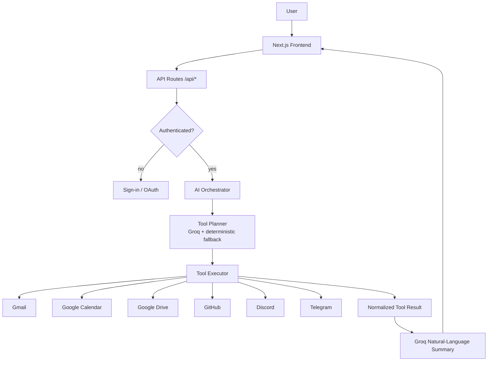
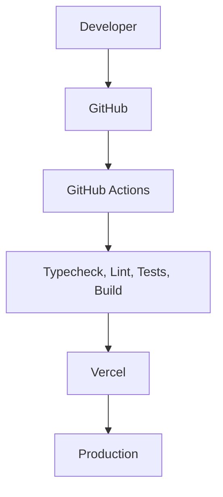

# BrieflyAI

**Ask your data anything — across every platform.**

BrieflyAI is an AI-powered productivity assistant that connects the tools you already use and answers natural-language questions about your real, live data. Summarize your inbox, prepare for tomorrow's meetings, review open GitHub issues, or catch up on Discord and Telegram — all from one dashboard.

<!-- Badges -->


[Live Demo](https://briefly-ai-tau.vercel.app/)

---

## Highlights

- **AI-powered productivity assistant** — natural-language questions about your real, live data
- **Cross-platform support** — Gmail, Google Calendar, Google Drive, GitHub, Discord, and Telegram
- **Secure OAuth 2.0 authentication** — no third-party passwords
- **Real-time AI summaries** — powered by Groq
- **Responsive, modern SaaS interface** — clean from mobile to desktop
- **Type-safe full-stack architecture** — Next.js & TypeScript
- **Production deployment on Vercel** — see the live demo above

---

## Features

BrieflyAI routes every request through a **tool planner → executor → Groq summarizer** pipeline. Tools retrieve *real* data from your connected accounts; the AI then explains it in plain language — nothing is fabricated.

### AI Assistant

| Capability | Description |
| --- | --- |
| Natural language interface | Ask questions like you'd ask a person, not a search box |
| Cross-platform queries | One question can pull from any connected integration |
| AI-generated summaries | Groq-powered responses grounded in live tool data |
| Smart search | Gmail-syntax search, Drive file search, Telegram message search |
| Context-aware responses | Actions, insights, and sources rendered as structured cards |

### Gmail

- Inbox summaries
- Email search (including Gmail syntax such as `has:attachment`)
- Unread emails
- Important email ranking
- Thread summaries

### Google Calendar

- Upcoming meetings
- Daily schedule
- Weekly overview
- Meeting preparation briefs

### Google Drive

- Recent files
- Search files
- Document summaries

### GitHub

- Repository summaries
- Open issues summary
- Recent activity (commits, PRs, releases)

### Discord

**Supported:** list your servers · summarize servers

**Limitation:** reading channels/messages requires a Discord Bot — Discord's OAuth API doesn't expose those endpoints, so the assistant explains the requirement instead of returning empty data.

### Telegram

- Recent messages
- Accessible chats (chats the bot has been added to)
- Chat summaries & news digests

---

## Screenshots


---

## Tech Stack

### Frontend

| Technology | Purpose |
| --- | --- |
| [Next.js](https://nextjs.org) 16 (App Router) | Framework, routing, server components |
| [React](https://react.dev) 19 | UI |
| [TypeScript](https://www.typescriptlang.org) 5 | Type-safe codebase |
| [Tailwind CSS](https://tailwindcss.com) 4 | Styling & design system |
| [Framer Motion](https://www.framer.com/motion) | Animations & transitions |

### Backend

| Technology | Purpose |
| --- | --- |
| Next.js API Routes | REST endpoints (`/api/*`) |
| OAuth 2.0 | Google, GitHub & Discord integration auth |

### AI

| Technology | Purpose |
| --- | --- |
| [Groq](https://groq.com) | Fast LLM inference (`llama-3.3-70b-versatile` by default) |

### Database

| Technology | Purpose |
| --- | --- |
| [PostgreSQL](https://www.postgresql.org) | Primary database |
| [Drizzle ORM](https://orm.drizzle.team) | Type-safe SQL & migrations |
| [Supabase](https://supabase.com) | Auth (email + Google OAuth) |

### DevOps & Deployment

| Technology | Purpose |
| --- | --- |
| [Docker](https://www.docker.com) | Multi-stage production image with health check |
| Docker Compose | Single-command startup for the full app |
| [GitHub Actions](https://github.com/features/actions) | CI on every push and pull request |
| [Vercel](https://vercel.com) | Production hosting |

### Testing

| Technology | Purpose |
| --- | --- |
| [Vitest](https://vitest.dev) | 150+ suites, 3,500+ unit & integration tests |
| [ESLint](https://eslint.org) | Linting & code quality |

---

## Architecture



**Request flow:** a natural-language query is classified into a tool → the tool calls the provider's API with the user's OAuth credentials → the result is normalized → Groq writes the summary → the frontend renders it as structured cards (summary, insights, actions, sources).

### Deployment Pipeline



Every push to `main` (and every pull request targeting it) runs the CI pipeline; only passing builds proceed to production on Vercel.

---

## DevOps & Deployment

| Area | Tool | Notes |
| --- | --- | --- |
| Containerization | [Docker](https://www.docker.com) | Multi-stage build, non-root runtime, health check on `/api/health` |
| Orchestration | Docker Compose | Start the full app with a single command |
| Continuous integration | [GitHub Actions](https://github.com/features/actions) | Typecheck, lint, tests, and production build on every push/PR |
| Hosting | [Vercel](https://vercel.com) | Production deployment — see the live demo |
| Secrets management | Environment variables | Read server-side only; grouped list in [Environment Variables](#environment-variables) |

### Docker

The [Dockerfile](Dockerfile) builds a small, production-ready image (multi-stage, runs as a non-root user) with a health check on `/api/health`.

**Build and run with Docker Compose** (recommended):

```bash
docker compose up --build
```

**Build and run with plain Docker:**

```bash
docker build -t brieflyai .
docker run -p 3000:3000 brieflyai
```

The container expects the environment variables listed in [Environment Variables](#environment-variables) — provide them in your shell, or pass a file with `docker run --env-file .env.local`.

### Continuous Integration

A [GitHub Actions workflow](.github/workflows/ci.yml) runs on every push and pull request to `main`/`master`. It validates the repository with:

1. **Type checking** — `npx tsc --noEmit`
2. **Linting** — `npm run lint`
3. **Tests** — `npm run test` (150+ Vitest suites)
4. **Production build** — `npm run build`
5. **Docker validation** — `docker compose config` and a Docker image build

A failing job blocks the merge, so every commit that reaches `main` is verified.

### Deployment

The application is hosted on **Vercel** — the [live demo](https://briefly-ai-tau.vercel.app/) runs the latest production build.

Because CI runs on every push to `main`, production always starts from a commit that passes typechecking, linting, the full test suite, and a production build. No unverified code reaches production.

---

## Project Structure

```
BrieflyAI/
├── app/                        # Next.js App Router
│   ├── (auth)/                 # Sign-in / sign-up pages
│   ├── dashboard/              # Dashboard, AI Assistant, Features, Integrations, Settings
│   └── api/                    # REST endpoints (integrations, AI, settings, health)
├── components/
│   ├── ai/                     # Structured AI response renderer
│   ├── dashboard/              # Sidebar, header, overview cards
│   ├── integrations/           # Integration cards, OAuth/bot-token connect dialogs
│   ├── settings/               # Settings sections & controls
│   └── features/               # Feature catalog UI
├── lib/
│   ├── ai/                     # Groq client, tool planner/executor, orchestrator
│   ├── services/               # Gmail, Calendar, Drive, GitHub, Discord, Telegram providers
│   ├── integrations/           # OAuth flows, token managers, live status store
│   ├── db/                     # PostgreSQL connection & schema
│   └── tools/                  # Tool registry & typed contracts
├── drizzle/                    # Database migrations
├── supabase/                   # Supabase configuration
├── tests/                      # Vitest suites
├── utils/                      # Supabase client/server helpers
└── package.json
```

---

## Installation

**Prerequisites**

- **Node.js 22+** — the version used by the CI pipeline and Docker image
- **npm 10+** — bundled with Node.js
- **PostgreSQL** — a running database instance (local or hosted)
- **Supabase project** — for email + Google authentication

```bash
# 1. Clone the repository
git clone https://github.com/divysaxena24/BrieflyAI.git
cd BrieflyAI

# 2. Install dependencies
npm install

# 3. Create your environment file
cp .env.example .env.local   # then fill in your values (see below)

# 4. Run database migrations
npm run db:migrate

# 5. Start the dev server
npm run dev
```

Open [http://localhost:3000](http://localhost:3000). Sign in with Google, then connect integrations from the **Integrations** page.

---

## Environment Variables

<details>
<summary><b>Core</b></summary>

| Variable | Description |
| --- | --- |
| `NEXT_PUBLIC_SUPABASE_URL` | Supabase project URL — used for authentication |
| `NEXT_PUBLIC_SUPABASE_PUBLISHABLE_KEY` | Supabase publishable key — used for authentication |
| `DATABASE_URL` | PostgreSQL connection string — consumed by Drizzle ORM |

</details>

<details>
<summary><b>AI</b></summary>

| Variable | Description |
| --- | --- |
| `GROQ_API_KEY` | Groq API key — **server only, never sent to the client** |

</details>

<details>
<summary><b>OAuth Providers</b></summary>

| Variable | Description |
| --- | --- |
| `GOOGLE_CLIENT_ID` | Google OAuth client ID (Gmail, Calendar, Drive) |
| `GOOGLE_CLIENT_SECRET` | Google OAuth client secret |
| `GOOGLE_REDIRECT_URI` | Google OAuth callback URL |
| `GITHUB_CLIENT_ID` | GitHub OAuth client ID |
| `GITHUB_CLIENT_SECRET` | GitHub OAuth client secret |
| `GITHUB_REDIRECT_URI` | GitHub OAuth callback URL |
| `DISCORD_CLIENT_ID` | Discord OAuth client ID |
| `DISCORD_CLIENT_SECRET` | Discord OAuth client secret |
| `DISCORD_REDIRECT_URI` | Discord OAuth callback URL |

</details>

<details>
<summary><b>Optional</b></summary>

| Variable | Description |
| --- | --- |
| `GROQ_MODEL` | Override the LLM model (default `llama-3.3-70b-versatile`) |
| `DEBUG_GROQ` | Set `true` for diagnostic Groq request logging |

</details>

> **Telegram:** no server-side environment variable is needed. Users create a bot with BotFather and paste their bot token into the connect dialog — the token is validated and stored per-user on the server.

---

## Usage

Once integrations are connected, open the **AI Assistant** and ask:

| Prompt | What it does |
| --- | --- |
| `Summarize my inbox` | Digests your recent Gmail messages |
| `Find internship emails` | Searches your Gmail for matching messages |
| `What meetings do I have tomorrow?` | Lists tomorrow's calendar events |
| `Show my recent Drive files` | Returns your latest Drive files |
| `Summarize my repositories` | Summarizes your GitHub repos |
| `Show my Discord servers` | Lists the servers you're in |
| `Search my Telegram messages` | Searches chats the bot can access |

---

## Design Goals

- **Modern SaaS interface** — polished, product-grade UI across every screen
- **Responsive layout** — consistent experience from 320px to 1920px (mobile drawer, adaptive grids)
- **Accessibility** — semantic markup, keyboard navigation, ARIA roles, reduced-motion support
- **Theming** — full light/dark/system theming, persisted per user
- **Secure authentication** — standard OAuth flows; no custom password schemes
- **AI-first experience** — every screen is designed to get you to the assistant faster

---

## Security

- **OAuth token protection** — tokens live server-side, are rotated and refreshed, and are never exposed to the frontend, logs, or API responses
- **Server-side API keys** — secrets such as `GROQ_API_KEY` and client secrets are read only on the server
- **No sensitive credentials on the client** — only the Supabase publishable key is exposed to the browser
- **Read-only scopes** — integrations request the least privilege required; destructive actions always require explicit confirmation
- **No password storage** — app auth is delegated to Supabase (email + Google)

---

## Current Limitations

- **Discord** — channel/message access requires a Discord Bot; OAuth alone only exposes server listing.
- **Telegram** — the bot can only see chats it has been added to and received an update from.
- **AI responses** depend on which integrations are connected — answers are only as good as the live data available.

---

## Roadmap

- [ ] Slack integration
- [ ] Outlook integration
- [ ] Notion integration
- [ ] AI Actions (perform tasks, not just read)
- [ ] More workspace connectors

---

## Contributing

Contributions are welcome! To get started:

1. Fork the repository
2. Create a feature branch: `git checkout -b feat/my-feature`
3. Make your changes and add tests
4. Run the checks:

```bash
npx tsc --noEmit   # typecheck
npm test           # 150+ Vitest suites
npm run build      # production build
```

5. Open a pull request with a clear description of the change

Please keep changes focused, preserve the existing conventions, and don't introduce unrelated refactors.

---

## License

This project is licensed under the [MIT License](LICENSE) — see the `LICENSE` file for details.

---

## Acknowledgements

- [Next.js](https://nextjs.org)
- [Supabase](https://supabase.com)
- [Groq](https://groq.com)
- [Google APIs](https://developers.google.com)
- [GitHub API](https://docs.github.com/rest)
- [Discord API](https://discord.com/developers/docs)
- [Telegram Bot API](https://core.telegram.org/bots/api)
- [Tailwind CSS](https://tailwindcss.com)
- [Framer Motion](https://www.framer.com/motion)
- [Drizzle ORM](https://orm.drizzle.team)
